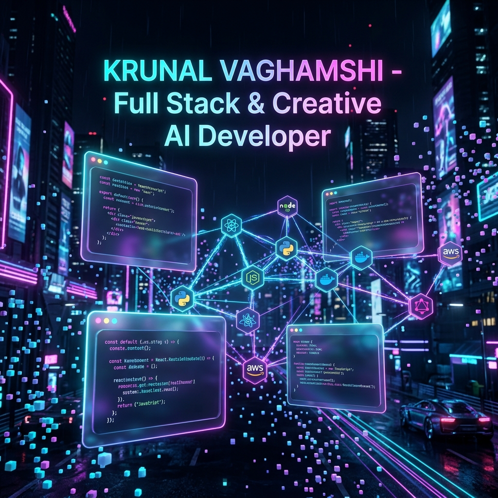

# 🚀 Krunal Vaghamshi — Creative Developer Portfolio



A high-performance, interactive, and visually stunning 3D developer portfolio built with **React**, **TypeScript**, **Three.js**, **Framer Motion**, and **Tailwind CSS**.

---

## ✨ Features

- 🎥 **Video Intro Experience:** Fullscreen introduction video with auto-mute, skip option, sound controls, replay, and smooth page transition.
- 🌌 **3D Hero Constellation:** Interactive 3D voxel particles & cybernetic mesh background powered by Three.js & `@react-three/fiber`.
- 📜 **Live GitHub Certifications:** Real-time recursive fetch of repository certificates with smooth 3-in-a-row pagination and zoomable inspection modal.
- ⚡ **Tech Universe:** Dynamic SVG constellation network with flowing data packet animations and glowing node pulses.
- 🤖 **Terminal Contact Section:** Interactive terminal contact form integrated with **EmailJS** for instant email transmission to Gmail.
- 🎨 **Rich Aesthetics:** Dark mode glassmorphism, custom smooth scrolling, fluid cursor simulation, and responsive layout.

---

## 🛠️ Tech Stack

- **Core:** React 19, TypeScript, Vite
- **3D & Canvas:** Three.js, @react-three/fiber, @react-three/drei, OGL
- **Animations:** Framer Motion, GSAP
- **Styling:** Tailwind CSS, Vanilla CSS Glassmorphism
- **Integrations:** EmailJS Browser SDK, GitHub REST API v3

---

## 🚦 Getting Started Locally

```bash
# Clone the repository
git clone https://github.com/krunal9116/dev-portfolio.git

# Navigate to project folder
cd dev-portfolio

# Install dependencies
npm install

# Start development server
npm run dev
```

---

## 📦 Production Build

```bash
npm run build
```

---

👤 **Developer:** [Krunal Vaghamshi](https://github.com/krunal9116)
